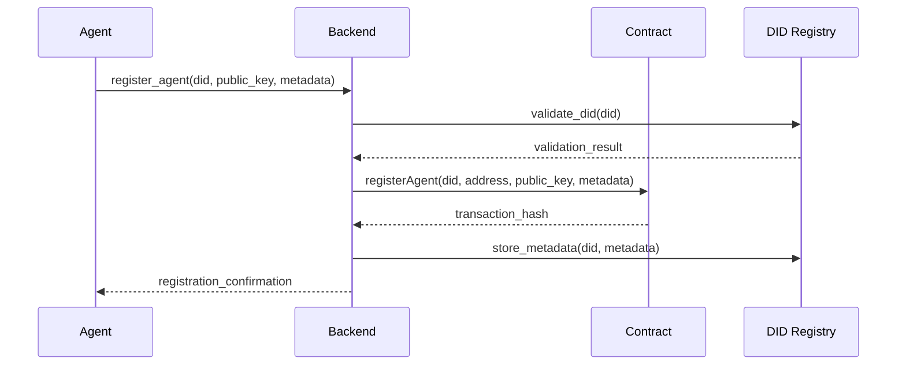
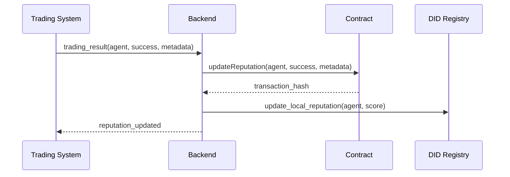
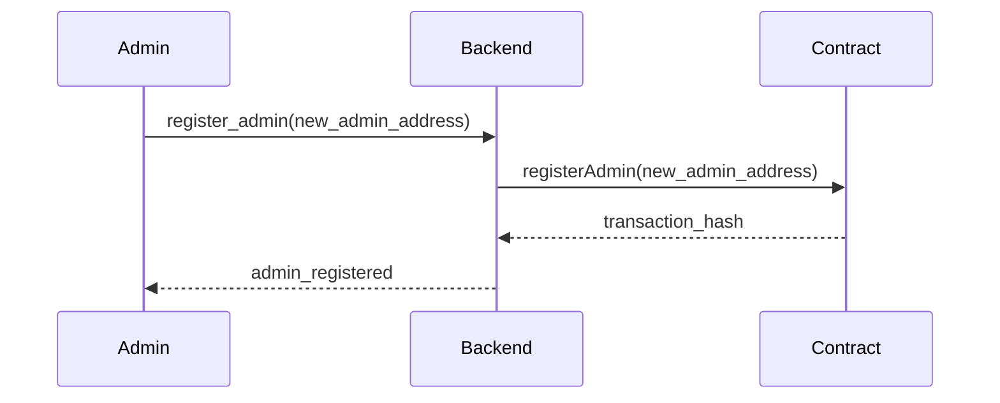
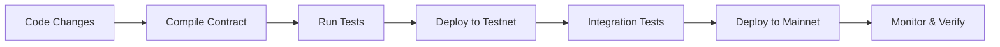

# AgentRegistry System Architecture & Design Document

## Table of Contents
1. [System Overview](#system-overview)
2. [Architecture Principles](#architecture-principles)
3. [High-Level Architecture](#high-level-architecture)
4. [Smart Contract Design](#smart-contract-design)
5. [Backend Architecture](#backend-architecture)
6. [Data Flow](#data-flow)
7. [Security Design](#security-design)
8. [Scalability Considerations](#scalability-considerations)
9. [Integration Patterns](#integration-patterns)
10. [Deployment Architecture](#deployment-architecture)
11. [Monitoring & Observability](#monitoring--observability)
12. [Future Architecture](#future-architecture)

---

## System Overview

### Purpose
The AgentRegistry system is a decentralized agent management platform that enables:
- **Agent Registration**: Secure registration of AI trading agents on the blockchain
- **Reputation Management**: Transparent reputation tracking and scoring
- **Access Control**: Role-based access control with admin management
- **DID Integration**: Decentralized identifier support for agent identity

### Key Components
1. **Smart Contract Layer** - Ethereum-based AgentRegistry contract
2. **Backend Services** - Python-based orchestration and management
3. **Agent Layer** - AI trading agents with blockchain integration
4. **DID Registry** - Decentralized identity management
5. **Monitoring System** - Performance and reputation tracking

---

## Architecture Principles

### 1. Decentralization
- **Blockchain-First**: All critical operations recorded on-chain
- **Trustless**: No single point of failure or control
- **Transparent**: All operations publicly verifiable

### 2. Security
- **Zero Trust**: Verify everything, trust nothing
- **Principle of Least Privilege**: Minimal required permissions
- **Immutable Audit Trail**: All changes permanently recorded

### 3. Scalability
- **Modular Design**: Independent, replaceable components
- **Horizontal Scaling**: Add more agents without system changes
- **Gas Optimization**: Efficient smart contract operations

### 4. Interoperability
- **Standards Compliance**: DID, JWT, and blockchain standards
- **API-First**: Clean interfaces for integration
- **Multi-Network**: Support for different blockchain networks

---

## High-Level Architecture

```
┌─────────────────────────────────────────────────────────────┐
│                    User Interface Layer                     │
│  ┌─────────────┐  ┌─────────────┐  ┌─────────────┐        │
│  │   Web UI    │  │  Mobile App │  │   API CLI   │        │
│  └─────────────┘  └─────────────┘  └─────────────┘        │
└─────────────────────────────────────────────────────────────┘
                              │
┌─────────────────────────────────────────────────────────────┐
│                   Backend Services Layer                    │
│  ┌─────────────┐  ┌─────────────┐  ┌─────────────┐        │
│  │ Agent       │  │ DID         │  │ Reputation  │        │
│  │ Orchestrator│  │ Registry    │  │ Manager     │        │
│  └─────────────┘  └─────────────┘  └─────────────┘        │
│  ┌─────────────┐  ┌─────────────┐  ┌─────────────┐        │
│  │ Blockchain  │  │ JWT         │  │ Risk        │        │
│  │ Interface   │  │ Manager     │  │ Evaluator   │        │
│  └─────────────┘  └─────────────┘  └─────────────┘        │
└─────────────────────────────────────────────────────────────┘
                              │
┌─────────────────────────────────────────────────────────────┐
│                   Blockchain Layer                          │
│  ┌─────────────────────────────────────────────────────────┐ │
│  │              AgentRegistry Contract                     │ │
│  │  ┌─────────────┐  ┌─────────────┐  ┌─────────────┐    │ │
│  │  │ Agent       │  │ Admin       │  │ Reputation  │    │ │
│  │  │ Management  │  │ Management  │  │ Tracking    │    │ │
│  │  └─────────────┘  └─────────────┘  └─────────────┘    │ │
│  └─────────────────────────────────────────────────────────┘ │
└─────────────────────────────────────────────────────────────┘
                              │
┌─────────────────────────────────────────────────────────────┐
│                   Agent Layer                               │
│  ┌─────────────┐  ┌─────────────┐  ┌─────────────┐        │
│  │ Risk        │  │ Trading     │  │ Expert      │        │
│  │ Evaluator   │  │ Agent       │  │ Trader      │        │
│  │ Agent       │  │             │  │ Agent       │        │
│  └─────────────┘  └─────────────┘  └─────────────┘        │
└─────────────────────────────────────────────────────────────┘
```

---

## Smart Contract Design

### Contract Architecture

#### Core Components
```solidity
contract AgentRegistry {
    // State Variables
    address public admin;
    mapping(bytes32 => Agent) public agents;
    mapping(address => uint256) public reputation;
    
    // Events
    event AdminChanged(address indexed oldAdmin, address indexed newAdmin);
    event AgentRegistered(bytes32 indexed did, address indexed agentAddress);
    event AgentDeactivated(bytes32 indexed did);
    event ReputationUpdated(address indexed agent, uint256 newReputation);
}
```

#### Data Structures
```solidity
struct Agent {
    bytes32 did;           // Decentralized Identifier
    address agentAddress;  // Agent's Ethereum address
    string publicKey;      // Agent's public key
    string metadata;       // JSON metadata
    bool isActive;         // Active status
    uint256 registrationTime; // Registration timestamp
    uint256 reputation;    // Current reputation score
}
```

### Function Categories

#### 1. Admin Functions
- `admin()` - Get current admin address
- `registerAdmin(address newAdmin)` - Transfer admin role
- `onlyAdmin` modifier - Access control

#### 2. Agent Management
- `registerAgent(bytes32 did, address agentAddress, string publicKey, string metadata)`
- `getAgent(bytes32 did)` - Retrieve agent information
- `deactivateAgent(bytes32 did)` - Deactivate agent

#### 3. Reputation Management
- `updateReputation(address agent, bool success, string metadata)`
- `getReputation(address agent)` - Get reputation score

### Security Features
- **Access Control**: Only admin can perform administrative functions
- **Input Validation**: DID format and address validation
- **State Consistency**: Atomic operations for data integrity
- **Event Logging**: All state changes logged for audit

---

## Backend Architecture

### Service Layer Design

#### 1. Agent Orchestrator (`backend/agent_orchestrator.py`)
```python
class AgentOrchestrator:
    def __init__(self):
        self.agent_registry = AgentRegistry()
        self.did_registry = DIDRegistry()
        self.risk_evaluator = RiskEvaluator()
    
    def register_agent(self, did, public_key, metadata):
        # Coordinate agent registration across all systems
        pass
    
    def evaluate_risk(self, agent_address):
        # Risk assessment and reputation updates
        pass
```

#### 2. Blockchain Interface (`backend/blockchain/agent_registry.py`)
```python
class AgentRegistry:
    def __init__(self, contract_address, admin_private_key):
        self.contract = self._load_contract(contract_address)
        self.admin_account = Account.from_key(admin_private_key)
    
    def register_agent(self, did, public_key, metadata):
        # Build and send transaction
        pass
    
    def get_agent(self, did):
        # Read agent data from blockchain
        pass
```

#### 3. DID Registry (`backend/did_registry.py`)
```python
class DIDRegistry:
    def __init__(self):
        self.did_file = "data/did_registry.json"
        self.reputation_file = "data/reputation.json"
    
    def register_did(self, did, metadata):
        # Local DID management
        pass
    
    def update_reputation(self, did, score):
        # Reputation tracking
        pass
```

### Data Flow Architecture

```
┌─────────────┐    ┌─────────────┐    ┌─────────────┐
│   Agent     │───▶│  Backend    │───▶│ Blockchain  │
│  Request    │    │  Services   │    │  Contract   │
└─────────────┘    └─────────────┘    └─────────────┘
                          │
                          ▼
                   ┌─────────────┐
                   │ Local Data  │
                   │  Storage    │
                   └─────────────┘
```

---

## Data Flow

### Agent Registration Flow



### Reputation Update Flow



### Admin Management Flow



---

## Security Design

### Authentication & Authorization

#### 1. Admin Authentication
- **Private Key Management**: Secure storage of admin private keys
- **Environment Variables**: Keys stored in `.env` files
- **Access Control**: Only admin can perform administrative functions

#### 2. Agent Authentication
- **DID Verification**: Decentralized identifier validation
- **Public Key Verification**: Cryptographic proof of identity
- **Address Verification**: Ethereum address ownership proof

#### 3. Transaction Security
- **Gas Estimation**: Proper gas calculation to prevent failures
- **Nonce Management**: Sequential transaction ordering
- **Error Handling**: Graceful failure handling and recovery

### Data Security

#### 1. On-Chain Data
- **Immutable**: All data permanently stored on blockchain
- **Transparent**: Publicly verifiable
- **Tamper-Proof**: Cryptographic integrity

#### 2. Off-Chain Data
- **Local Storage**: DID registry and reputation data
- **Backup Strategy**: Regular backups of critical data
- **Access Control**: File system permissions

### Smart Contract Security

#### 1. Access Control
```solidity
modifier onlyAdmin() {
    require(msg.sender == admin, "Only admin can call this function");
    _;
}
```

#### 2. Input Validation
```solidity
function registerAgent(bytes32 did, address agentAddress, string memory publicKey, string memory metadata) external onlyAdmin {
    require(did != bytes32(0), "DID cannot be zero");
    require(agentAddress != address(0), "Agent address cannot be zero");
    require(!agents[did].isActive, "Agent already registered");
    // ... rest of function
}
```

#### 3. State Management
- **Atomic Operations**: All state changes in single transaction
- **Event Logging**: Complete audit trail
- **Error Recovery**: Graceful handling of failures

---

## Scalability Considerations

### Horizontal Scaling

#### 1. Agent Scaling
- **Independent Agents**: Each agent operates independently
- **Parallel Processing**: Multiple agents can operate simultaneously
- **Load Distribution**: Agents distributed across different nodes

#### 2. Backend Scaling
- **Microservices**: Independent service components
- **Stateless Design**: Services can be replicated
- **Database Scaling**: Separate data storage for different components

### Vertical Scaling

#### 1. Smart Contract Optimization
- **Gas Efficiency**: Optimized function calls
- **Batch Operations**: Multiple operations in single transaction
- **Storage Optimization**: Efficient data structures

#### 2. Backend Optimization
- **Caching**: Frequently accessed data caching
- **Connection Pooling**: Database connection optimization
- **Async Processing**: Non-blocking operations

### Network Scaling

#### 1. Multi-Network Support
- **Network Abstraction**: Support for different blockchains
- **Cross-Chain**: Operations across multiple networks
- **Network Selection**: Choose optimal network for operations

#### 2. Layer 2 Solutions
- **Sidechains**: Off-chain processing with on-chain settlement
- **State Channels**: Off-chain state management
- **Rollups**: Batch transaction processing

---

## Integration Patterns

### API Integration

#### 1. RESTful APIs
```python
# Agent registration endpoint
POST /api/v1/agents
{
    "did": "did:eth:0x...",
    "public_key": "...",
    "metadata": {...}
}
```

#### 2. WebSocket Integration
```python
# Real-time updates
ws://localhost:8000/ws/agents
{
    "type": "reputation_update",
    "agent": "0x...",
    "score": 85
}
```

### Blockchain Integration

#### 1. Web3 Integration
```python
from web3 import Web3
from eth_account import Account

class BlockchainInterface:
    def __init__(self, rpc_url, contract_address):
        self.w3 = Web3(Web3.HTTPProvider(rpc_url))
        self.contract = self.w3.eth.contract(
            address=contract_address,
            abi=contract_abi
        )
```

#### 2. Event Listening
```python
def listen_for_events():
    event_filter = contract.events.AgentRegistered.create_filter(fromBlock='latest')
    while True:
        for event in event_filter.get_new_entries():
            process_agent_registration(event)
```

### External System Integration

#### 1. Trading Systems
- **Market Data**: Real-time market data integration
- **Order Management**: Trading order execution
- **Risk Management**: Risk assessment and limits

#### 2. Identity Systems
- **DID Resolution**: DID document resolution
- **Credential Verification**: Verifiable credential validation
- **Identity Providers**: Integration with identity providers

---

## Deployment Architecture

### Environment Configuration

#### 1. Development Environment
```bash
# .env.development
NETWORK=sepolia
CONTRACT_ADDRESS=0x60f0393Bc70282E0ceE22E4Acb15B2EB869a0232
ADMIN_PRIVATE_KEY=0x...
RPC_URL=https://sepolia.infura.io/v3/...
```

#### 2. Production Environment
```bash
# .env.production
NETWORK=mainnet
CONTRACT_ADDRESS=0x...
ADMIN_PRIVATE_KEY=0x...
RPC_URL=https://mainnet.infura.io/v3/...
```

### Deployment Pipeline



### Infrastructure Components

#### 1. Blockchain Infrastructure
- **RPC Providers**: Infura, Alchemy, or self-hosted nodes
- **Gas Management**: Gas price monitoring and optimization
- **Network Monitoring**: Transaction confirmation tracking

#### 2. Backend Infrastructure
- **Application Servers**: Python web servers
- **Database**: Local file storage or external databases
- **Load Balancers**: Traffic distribution
- **Monitoring**: System health monitoring

#### 3. Security Infrastructure
- **Key Management**: Secure private key storage
- **Access Control**: Network and application security
- **Audit Logging**: Complete operation logging

---

## Monitoring & Observability

### System Monitoring

#### 1. Contract Monitoring
```python
class ContractMonitor:
    def monitor_transactions(self):
        # Monitor pending transactions
        pass
    
    def monitor_events(self):
        # Monitor contract events
        pass
    
    def monitor_gas_prices(self):
        # Monitor gas price fluctuations
        pass
```

#### 2. Performance Monitoring
- **Transaction Success Rate**: Track successful vs failed transactions
- **Gas Usage**: Monitor gas consumption patterns
- **Response Times**: API response time tracking
- **Error Rates**: System error monitoring

#### 3. Business Metrics
- **Agent Registration Rate**: New agent registrations
- **Reputation Changes**: Reputation score updates
- **Admin Operations**: Administrative function usage
- **System Uptime**: Overall system availability

### Logging Strategy

#### 1. Structured Logging
```python
import logging
import json

def log_agent_registration(did, agent_address, metadata):
    logging.info(json.dumps({
        "event": "agent_registration",
        "did": did,
        "agent_address": agent_address,
        "metadata": metadata,
        "timestamp": datetime.utcnow().isoformat()
    }))
```

#### 2. Log Levels
- **DEBUG**: Detailed debugging information
- **INFO**: General operational information
- **WARNING**: Warning conditions
- **ERROR**: Error conditions
- **CRITICAL**: Critical system failures

### Alerting System

#### 1. Critical Alerts
- **Contract Failures**: Failed contract transactions
- **Admin Balance**: Low admin account balance
- **System Errors**: Application errors and exceptions
- **Network Issues**: Blockchain network connectivity

#### 2. Performance Alerts
- **High Gas Prices**: Unusually high gas prices
- **Slow Transactions**: Long transaction confirmation times
- **High Error Rates**: Increased error rates
- **Resource Usage**: High resource consumption

---

## Future Architecture

### Planned Enhancements

#### 1. Multi-Network Support
```python
class MultiNetworkRegistry:
    def __init__(self):
        self.networks = {
            'ethereum': EthereumNetwork(),
            'polygon': PolygonNetwork(),
            'arbitrum': ArbitrumNetwork()
        }
    
    def register_agent_multi_network(self, did, networks):
        # Register agent across multiple networks
        pass
```

#### 2. Advanced Reputation System
```solidity
struct ReputationScore {
    uint256 overall_score;
    uint256 trading_score;
    uint256 risk_score;
    uint256 reliability_score;
    uint256 last_updated;
    uint256 total_transactions;
}
```

#### 3. Governance System
```solidity
contract AgentRegistryGovernance {
    mapping(address => uint256) public voting_power;
    mapping(bytes32 => Proposal) public proposals;
    
    function createProposal(string memory description) external;
    function vote(bytes32 proposalId, bool support) external;
    function executeProposal(bytes32 proposalId) external;
}
```

#### 4. Layer 2 Integration
- **Optimistic Rollups**: High-throughput transaction processing
- **ZK-Rollups**: Privacy-preserving operations
- **State Channels**: Off-chain state management

### Scalability Roadmap

#### Phase 1: Foundation (Current)
- ✅ Basic agent registration
- ✅ Reputation tracking
- ✅ Admin management
- ✅ Single network support

#### Phase 2: Enhancement
- 🔄 Multi-network support
- 🔄 Advanced reputation algorithms
- 🔄 Governance mechanisms
- 🔄 Enhanced security features

#### Phase 3: Advanced Features
- 📋 Layer 2 integration
- 📋 Cross-chain operations
- 📋 Advanced analytics
- 📋 Machine learning integration

#### Phase 4: Enterprise
- 📋 Enterprise-grade security
- 📋 Compliance features
- 📋 Advanced monitoring
- 📋 Custom integrations

---

## Conclusion

The AgentRegistry system architecture provides:

### ✅ **Current Capabilities**
- **Decentralized Agent Management**: Secure blockchain-based agent registration
- **Reputation System**: Transparent reputation tracking and scoring
- **Admin Control**: Secure administrative operations
- **DID Integration**: Decentralized identity support
- **Scalable Design**: Modular architecture for growth

### 🚀 **Future Potential**
- **Multi-Network**: Support for multiple blockchain networks
- **Advanced Governance**: Decentralized governance mechanisms
- **Layer 2 Scaling**: High-throughput transaction processing
- **Enterprise Features**: Compliance and security enhancements

### 🎯 **Architecture Benefits**
- **Security**: Blockchain-based security and transparency
- **Scalability**: Modular design for horizontal and vertical scaling
- **Interoperability**: Standards-compliant interfaces
- **Maintainability**: Clean separation of concerns
- **Extensibility**: Easy addition of new features and networks

**The architecture is designed to support the current requirements while providing a solid foundation for future growth and enhancement.** 